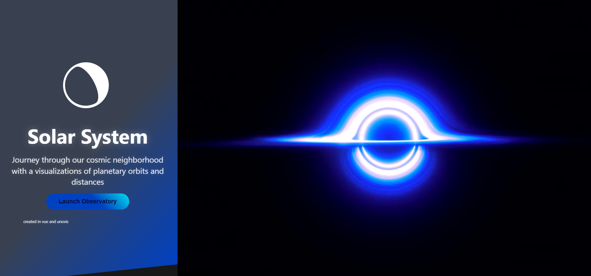
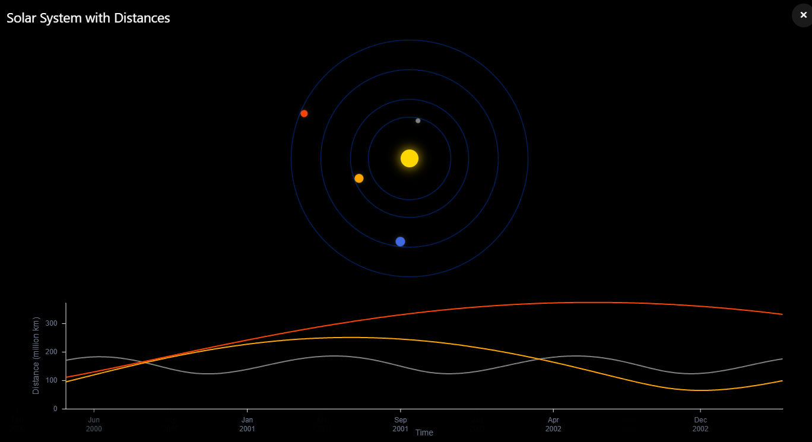

# Observerly Demo

This repository serves as a demo for **Observerly**, showcasing the use of **Vue** and **TypeScript** along with **Unovis** for data visualization. It provides an example of integrating these tools to create a reactive and visually engaging application.


- **Vue**: Utilized as the main framework for building a responsive and component-based UI.
- **TypeScript**: Enforces type safety and enhances code reliability across the project.
- **Unovis**: Used for intuitive and interactive data visualization, making it easy to produce insightful visual elements.

## Project Setup

```sh
npm install
```

### Compile and Hot-Reload for Development

```sh
npm run dev
```

### Compile and Minify for Production

```sh
npm run build
```



